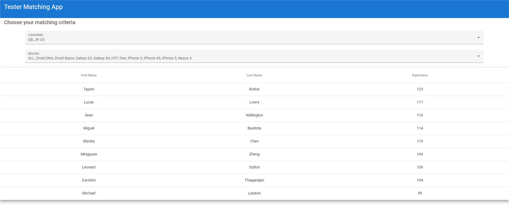
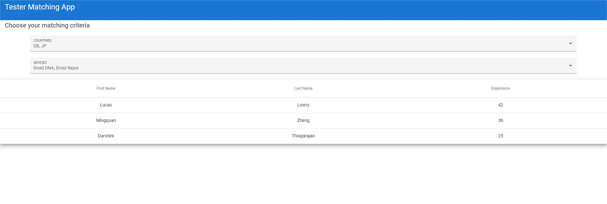

# ApplauseHomeTask
Applause: Coding Assignment - Tester Matching

## About

Simple tester-matching application written for recruitment process for Applause company.

## Stack

Database: \
H2

Back-end: \
Java 11 \
Spring Boot 2.4.4 \
Lombok \
JUnit 5 \
SimpleFlatMapper \
Swagger

Front-end: \
Angular 11 \
Angular Material 11

## How To Run

Install the Angular CLI: \
npm install -g @angular/cli

Compile and run ApplauseHomeTaskApplication. \
Then go to frontend-app directory and run command: ng serve. 

Application will be available in your browser at: http://localhost:4200/

Swagger is available at: http://localhost:8080/swagger-ui

## Examples

